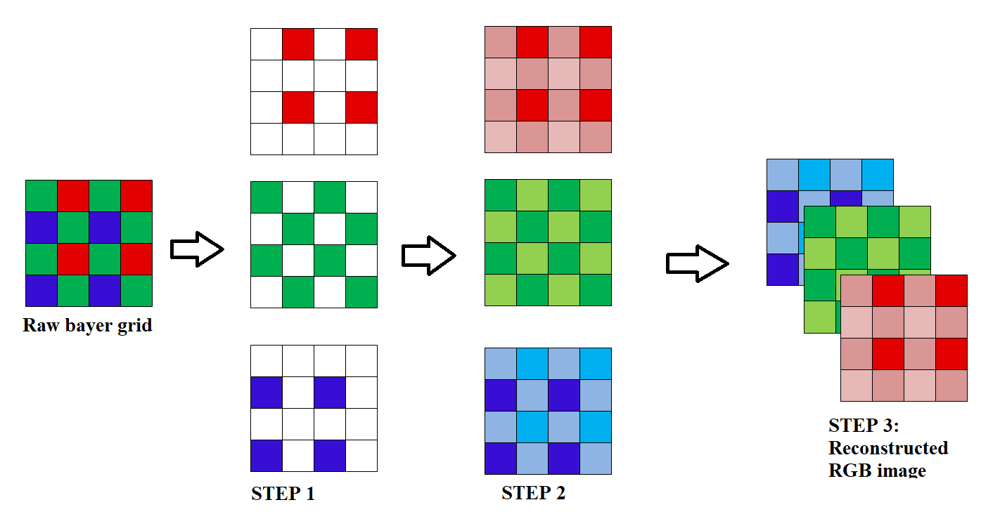
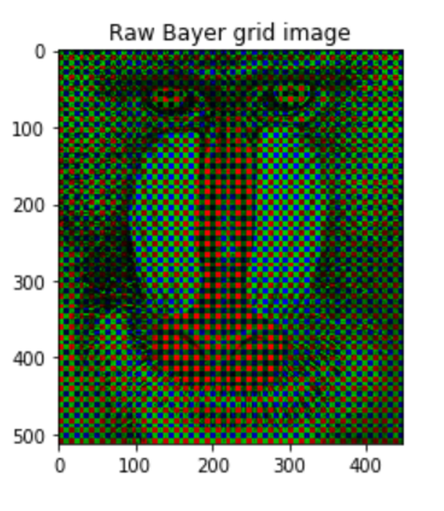
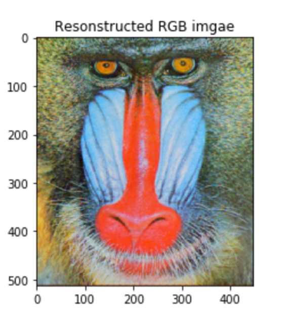

# Bayer-interpolation
Conversion of Bayer raw image into Full RGB image

Although today’s digital cameras output RGB colour pictures, most of them do not have three separate RGB colour sensors but only one single sensor based on a colour filter array (CFA), where alternating sensor sites are covered by different colour filters. The process is known as ‘Demosaicing’. The Bayer pattern is the most commonly used pattern. 

STEPS: 
1.	Red, Green and Blue colour channels are separated by filling missing values with zero in the function ‘separatechannels’. 
2.	The missing parts of separated R, G and B colour channels are filled using interpolation in the function ‘interpolate’. In this, each plane is first convolved using matrix np.ones((3,3)) and then intensity is averaged according to the number of neighbouring pixels of the same colour.
3.	The three planes are assembled into single image with 3 planes in the function ‘assembleimage’.

Refer Image below, to understand what's actually happening in each step.

Results:

1. Raw Bayer grid 

2. RGB construction

